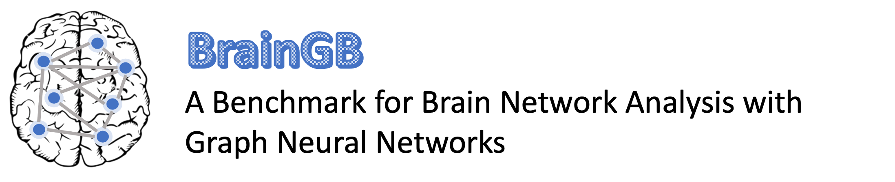

<p align="center">

</p>

<!-- BrainGB is an open-source benchmark package for Brain Network Analysis with Graph Neural Networks based on [PyTorch](https://pytorch.org) and [PyTorch Geometric](https://pytorch-geometric.readthedocs.io/en/latest/). It features modularized design space of interest of GNNs for brain networks, and standardized evaluation. -->

BrainGB is a *unified*, *modular*, *scalable*, and *reproducible* framework established for brain network analysis with GNNs. It is designed to enable fair evaluation with accessible datasets, standard settings, and baselines to foster a collaborative environment within computational neuroscience and other related communities. This library is built upon [PyTorch](https://pytorch.org) and [PyTorch Geometric](https://pytorch-geometric.readthedocs.io/en/latest/).

The [BrainGB paper](https://cs.emory.edu/~jyang71/files/braingb.pdf) is published in [IEEE Transactions on Medical Imaging](https://www.embs.org/tmi/) (TMI, IF: 11.037) - Special Issue on Geometric Deep Learning in Medical Imaging. To foster research, we also provide an out-of-box package that can be installed directly using pip, with detailed tutorials available on our hosted [BrainGB website](https://brainnet.us/). 

### Acknowledgement

The development of this toolbox is partially supported by NIH (R01MH105561, R01MH118771, R01AG071243, R01MH125928, U01AG068057), NSF (IIS 2045848, IIS 1837956) and ONR (N00014-18-1-2009).

---
[](https://github.com/HennyJie/BrainGB "Go to GitHub repo")
[](https://github.com/HennyJie/BrainGB)
[](https://github.com/HennyJie/BrainGB)


---

 

<!-- # BrainGB

BrainGB is a python package for testing Graph Neural Networks on Brain Networks.  -->
# Library Highlights
Our BrainGB implements four main modules of GNN models for brain network analysis:
* **Node feature construction**: studies practical and effective methods to initialize either positional or structural node features for each brain region.
* **Message passing mechanisms**: update the node representation of each brain region iteratively by aggregating neighbor features through local connections.
* **Attention-enhanced message passing**: incorporates attention mechanism to enhance the message passing scheme of GNNs. 
* **Pooling strategies**: operate on the set of node vectors to get a graph-level representation.

BrainGB also implements utility functions for model training, performance evaluation, and experiment management.

# Using BrainGB
There are two ways to use BrainGB: the first is running direct experiments with BrainGB, and the second is integrating BrainGB into your existing research projects. Follow the sections below to learn more.

## Direct Experiments with BrainGB

### 1. Obtaining Datasets

#### **ABIDE Dataset**
We understand the challenges faced by researchers in accessing certain datasets due to restrictions. To facilitate your experimentation with BrainGB, we provide the [Autism Brain Imaging Data Exchange (ABIDE) dataset](http://fcon_1000.projects.nitrc.org/indi/abide/abide_I.html), which is publicly accessible and does not require special access permissions. 

- [Download and Preprocess ABIDE dataset here](https://github.com/HennyJie/BrainGB/tree/master/examples/utils/get_abide)


#### **Datasets Requiring Access**
For a detailed exploration of other datasets like **PNC**, **PPMI**, and **ABCD** utilized in our BrainGB studies, which are not publicly accessible and require specific access permissions, please refer to the following:

- [Other Datasets and Decription](https://braingb.us/datasets/)

- [Preprocessing Steps and Protocols](https://braingb.us/preprocessing/)


You can also construct your own datasets by following the instructions on neuroimaging preprocessing and functional or structural brain network construction on our [website](https://braingb.us/preprocessing/).

---

### 2. Quick Setup

Clone the repository and Install required dependencies:
```shell
git clone https://github.com/HennyJie/BrainGB.git
```
It is recommended to use commands such as 'virtualenv' to create separate Python environments, in order to prevent conflicts in environment configurations:
```shell
virtualenv -p python3 venv
source venv/bin/activate
```
**Install Dependencies:**
BrainGB depends on the following packages. **The packages listed below are dependencies for systems with CUDA version 10.1. If you are using a different version of CUDA, please ensure to install the respective versions of these dependencies that are compatible with your CUDA version**. See [Pytorch version with different CUDA versions](https://pytorch.org/get-started/previous-versions/):
```
torch~=1.8.1+cu101
torch-cluster~=1.5.9
torch-scatter~=2.0.8       
torch-sparse~=0.6.12
torch-spline-conv~=1.2.1
torch-geometric~=2.0.4
numpy~=1.22.2
nni~=2.4
scikit-learn~=1.0.2
networkx~=2.6.2
scipy~=1.7.3
pandas~=1.2.3
```
First, install some of the dependencies with:
```shell
pip install -r requirements.txt
```
Next, install Pytorch:
```shell
pip install torch==1.8.1+cu101 torchvision==0.9.1+cu101 torchaudio==0.8.1 -f https://download.pytorch.org/whl/torch_stable.html
```
Finally, install torch-cluster, torch-scatter, torch-sparse, torch-spline-conv and torch-geometric
```shell
pip install https://data.pyg.org/whl/torch-1.8.0%2Bcu101/torch_cluster-1.5.9-cp38-cp38-linux_x86_64.whl
pip install https://data.pyg.org/whl/torch-1.8.0%2Bcu101/torch_scatter-2.0.8-cp38-cp38-linux_x86_64.whl
pip install https://data.pyg.org/whl/torch-1.8.0%2Bcu101/torch_sparse-0.6.12-cp38-cp38-linux_x86_64.whl
pip install https://data.pyg.org/whl/torch-1.8.0%2Bcu101/torch_spline_conv-1.2.1-cp38-cp38-linux_x86_64.whl
pip install torch-geometric~=2.0.4
```

**Note**: If you face problems when installing dependencies like torch-cluster, torch-scatter, torch-sparse, torch-spline-conv, and torch-geometric, it is recommended to manually install the respective version of these packages using the **'.whl'** files available on their official website.


---

### 3. Running Example
Use the ABIDE dataset as an example, you should first place the dataset file "abide.npy" (genereated from [step 1](#1-obtaining-datasets)) in the `datasets` folder under the `examples` folder (Create the folder if it does not exist). The `abide.npy` file contains the following contents:

- **timeseries**: Represents the BOLD time series data for each subject. It's a numpy array with the shape (#sub, #ROI, #timesteps).
  
- > **Label**: Provides the diagnosis label for Autism spectrum disorder for each subject. '0' denotes negative, and '1' indicates positive. It's a numpy array of shape (#sub).
  
- > **corr**: The correlation matrix calculated from BOLD time series data. It's a numpy array with the shape (#sub, #ROIs, #ROIs).
  
- **pcorr**: Represents the partial correlation matrix derived from the BOLD time series data. It's a numpy array with dimensions (#sub, #ROIs, #ROIs).
  
- **site**: Specifies where the data was collected for each subject. It's a numpy array with shape (#sub).

**`Important Note`**: `"Label"` and `"corr matrix"` are the actual *inputs* for BrainGB. `Label` represents the target outcome we are interested in predicting, often indicating the diagnosis or condition of a subject in a brain study. `corr matrix` describes the associated Brain Network. If you are considering running BrainGB using your own dataset, it's important to format your Label and corr matrix similarly to ensure compatibility and accurate results. Ensure that `Label` is in a *numpy array* of shape **(#sub)** and `corr matrix` is structured as a *numpy array* with the shape **(#sub, #ROIs, #ROIs)**.<br><br>


#### **Run the BrainGB code, execute the following command**:
```shell
python -m examples.example_main --dataset_name ABIDE --pooling concat --gcn_mp_type edge_node_concate --hidden_dim 256
```
The parameter `pooling` specifies the pooling strategy to get a graph-level representation for each subject and `gcn_mp_type` sets a message vector design for the `gcn` model. If you choose `gat` as the backbone model, you can use `gat_mp_type` to set an attention-enhancing mechanism.

For other hyper-parameters like `--n_GNN_layer`, `--n_MLP_layers`, `--hidden_dim`, `--epochs`, etc., you can modify them to adjust the detailed model design or control the training process. If you'd like to automatically search and optimize these hyper-parameters, use the AutoML tool NNI with the `--enable_nni` command.

Upon successful execution, you should observe an output similar to this:

```plaintext
Processing...
Done!
2023-09-10 15:54:28,486 - Loaded dataset: ABIDE
...
2023-09-10 15:56:29,493 - (Train Epoch 9), test_micro=66.34, test_macro=65.10, test_auc=72.91
...
2023-09-10 17:37:46,561 - (Train Epoch 99), test_micro=64.68, test_macro=64.59, test_auc=70.03
2023-09-10 17:37:47,489 - (Initial Performance Last Epoch) | test_micro=64.68, test_macro=64.59, test_auc=70.03
2023-09-10 17:37:47,489 - (K Fold Final Result)| avg_acc=65.31 +-  1.58, avg_auc=71.29 +- 2.89, avg_macro=64.43 +- 1.87
```

---

### 4. Customizing Your Own GNN Models
#### Node Feature Construction
In `src.dataset.tranforms`, BrainGB provides the `BaseTransform` base class, which offers a universal interface for node feature initialization for each brain region. Specifically, BrainGB implements the following node feature construction functions: 

| Node Features                            | Option Name        |
| --------------------------------------- | ----------------- |
| Identity                        | `identity`      |
| Eigen                      | `eigenvector`    |
| Degree                   | `degree`  |
| Degree Profile                    | `LDP`  |
| Connection Profile           | `adj` |

To adjust the type of node features, simply set the chosen option name for the input parameter `node_features`.

#### Message Passing Mechanisms
In `models.gcn`, BrainGB provides the base class `MPGCNConv` and different message vector designs including: 
| Message Passing Mechanisms                    | Option Name          |
| ------------------------------------ | ------------------- |
| Edge Weighted | `weighted_sum`  |
| Bin Concat        | `bin_concate` |
| Edge Weight Concat | `edge_weight_concate`  |
| Node Edge Concat        | `edge_node_concate` |
| Node Concat        | `node_concate` |

To adjust the message passing schemes, simply set the input parameter `model_name` as `gcn` and chose an option name for the parameter `gcn_mp_type`.

#### Attention-Enhanced Message Passing
In `models.gat`, BrainGB provides the base class `MPGATConv` and different versions of attention-enhanced message passing designs including:
| Message Passing Mechanisms                    | Option Name          |
| ------------------------------------ | ------------------- |
| Attention Weighted | `attention_weighted`  |
| Edge Weighted w/ Attn        | `attention_edge_weighted` |
| Attention Edge Sum | `sum_attention_edge`  |
| Node Edge Concat w/ Attn        | `edge_node_concate` |
| Node Concat w/ Attn        | `node_concate` |

Note that some of these options are corresponding attention enhanced version of the message passing mechanism designs. Please refer to our paper for more details.

To adjust the attention-enhanced message passing schemes, simply set the input parameter `model_name` as `gat` and chose an option name for the parameter `gat_mp_type`.

#### Pooling Strategies
The pooling strategy is controlled by setting the `self.pooling` in the chosen model. Specifically, BrainGB implements the following three basic pooling strategies: 
| Pooling Strategies                    | Option Name          |
| ------------------------------------ | ------------------- |
| Mean Pooling | `mean`  |
| Sum Pooling        | `sum` |
| Concat Pooling | `concat`  |

To adjust the pooling strategies, simply set the chosen option name for the input parameter `pooling`.


---

## Integrating BrainGB into Your Workflow

### 1. Install BrainGB as a package


To integrate BrainGB into your research projects and leverage its capabilities, install the package via your package manager:

```shell
pip install BrainGB
```
Notice that if you install the package through pip, the dependencies are automatically installed.

### 2. Incorporating BrainGB Models

BrainGB provides modular components, making it easier to integrate with various projects. Import the necessary modules and initialize the models according to your research needs.

```python
from BrainGB.models import GAT, GCN, BrainNN
```
The BrainNN is required and will be served as the parent module of the GAT, GCN models. You may choose either GAT or GCN as the submodule.

#### Model Initialization:  
For a GCN-based setup:
```python
sample: Data = Data()  # A torch geometric data
num_features = data.x.shape[1]
num_nodes = data.x.shape[0]
gcn_model = GCN(num_features, num_nodes)
model = BrainNN(args.pooling, gcn_model, MLP(2 * num_nodes))
```
For a GAT-based setup, simply replace the GCN model initializations with GAT. Both models are customizable. Please refer to the [Customizing Your Own GNN Models](#4-customizing-your-own-gnn-models) section for more details. 


# Contribution

Feel free to open an [issue](issues/new) should you find anything unexpected or [create pull requests](pulls) to add your own work! We welcome contributions to this benchmark work and the package.


# Our Recent Papers on GNN-based Brain Connectome Analysis using BrainGB

Here's a list of publications from our research group related to Brain Network Analysis:


| Year | Title                                                                                                             | Venue      | Code                                                                                           | Paper                                                                                                 |
|------|-------------------------------------------------------------------------------------------------------------------|------------|------------------------------------------------------------------------------------------------|-------------------------------------------------------------------------------------------------------|
| 2024 | FedBrain: Federated Training of Graph Neural Networks for Connectome-based Brain Imaging Analysis                                      | PSB 2024   | [Link](mailto:owen.yang@duke.edu)                                     | [Link](mailto:owen.yang@duke.edu)                                                        |
| 2024 | BrainSTEAM: A Practical Pipeline for Connectome-based fMRI Analysis towards Subject Classification                                      | PSB 2024   | [Link](mailto:li.alexis1111@gmail.com)                                     | [Link](mailto:li.alexis1111@gmail.com)                                                         |
| 2023 | R-Mixup: Riemannian Mixup for Biological Networks                                      | KDD 2023   | [Link](mailto:xuan.kan@emory.edu)                                     | [Link](https://dl.acm.org/doi/abs/10.1145/3580305.3599483)                                                         |
| 2023 | Dynamic Brain Transformer with Multi-level Attention for Brain Network Analysis                                      | BHI 2023   | [Link](https://github.com/Wayfear/Dynamic-Brain-Transformer)                                     | [Link](https://arxiv.org/pdf/2309.01941.pdf)                                                         |
| 2023 | Transformer-based Hierarchical Clustering for Brain Network Analysis                                                 | ISBI 2023  | [Link](https://github.com/DDVD233/THC)                                                          | [Link](https://ieeexplore.ieee.org/abstract/document/10230606)                                              |
| 2023 | Deep DAG Learning of Effective Brain Connectivity for fMRI Analysis                                                   | ISBI 2023  | [Link](https://github.com/yueyu1030/DABNet/tree/main)                                        |        [Link](https://ieeexplore.ieee.org/abstract/document/10230429)                                                   |  
| 2023 | PTGB: Pre-Train Graph Neural Networks for Brain Network Analysis                                                     | CHIL 2023  | [Link](https://github.com/Owen-Yang-18/BrainNN-PreTrain)                                        | [Link](https://proceedings.mlr.press/v209/yang23a.html)                                                         |
| 2022 | Comparing Shallow and Deep Graph Models for Brain Network Analysis | BrainNN 2022 | [Link](mailto:young.j.ethan@gmail.com) | [Link](https://cs.emory.edu/~jyang71/files/reu2022.pdf) |
| 2022 | BrainMixup: Data Augmentation for GNN-based Functional Brain Network Analysis | BrainNN 2022 | [Link](mailto:li.alexis1111@gmail.com) | [Link](https://cs.emory.edu/~jyang71/files/bmixup-brainnn.pdf) |
| 2022 | Data-Efficient Brain Connectome Analysis via Multi-Task Meta-Learning                                                  | KDD 2022  | [Link](https://github.com/Owen-Yang-18/BrainNN-PreTrain)                                       | [Link](https://dl.acm.org/doi/abs/10.1145/3534678.3542680)       | 
| 2022 | Brain Network Transformer                                                                                       | NeurIPS 2022 | [Link](https://github.com/Wayfear/BrainNetworkTransformer)                                      | [Link](https://proceedings.neurips.cc/paper_files/paper/2022/hash/a408234a9b80604a9cf6ca518e474550-Abstract-Conference.html)                                                             |
| 2022 | Multi-View Brain Network Analysis with Cross-View Missing Network Generation                                        | BIBM 2022  | [Link](https://github.com/GongxuLuo/CroGen)                                                    | [Link](https://ieeexplore.ieee.org/document/9995283)                                                 |
| 2022 | Joint Embedding of Structural and Functional Brain Networks with Graph Neural Networks for Mental Illness Diagnosis                                                  | EMBC 2022  | [Link](mailto:yzhu@cs.ucla.edu)     |  [Link](https://ieeexplore.ieee.org/abstract/document/9871118)   |
| 2022 | Interpretable Graph Neural Networks for Connectome-Based Brain Disorder Analysis                                    | MICCAI 2022 | [Link](https://github.com/HennyJie/IBGNN)                                                       | [Link](https://link.springer.com/chapter/10.1007/978-3-031-16452-1_36)                                                             |
| 2022 | FBNetGen: Task-aware GNN-based fMRI Analysis via Functional Brain Network Generation                                | MIDL 2022  | [Link](https://github.com/Wayfear/FBNETGEN)                                                     | [Link](https://proceedings.mlr.press/v172/kan22a.html)                                                             |
| 2022 | BrainGB: A Benchmark for Brain Network Analysis with Graph Neural Networks                                         | TMI 2022   | [Link](https://github.com/HennyJie/BrainGB)                                                    | [Link](https://ieeexplore.ieee.org/abstract/document/9933896)                                                             |

These publications offer a range of approaches and tools for those interested in Brain Network Analysis.


# Citation

Please cite our paper if you find this code useful for your work:

```
@article{cui2022braingb,
author = {Cui, Hejie and Dai, Wei and Zhu, Yanqiao and Kan, Xuan and Chen Gu, Antonio Aodong and Lukemire, Joshua and Zhan, Liang and He, Lifang and Guo, Ying and Yang, Carl},
title = {{BrainGB: A Benchmark for Brain Network Analysis with Graph Neural Networks}},
journal={TMI},
year = {2022},
}
```
